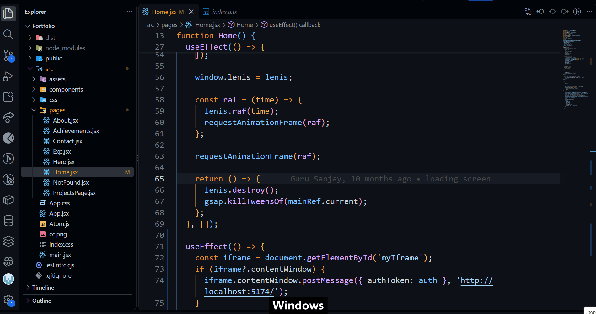

# Desktop Switcher

Jump straight to any Windows virtual desktop with **Ctrl + Win + number**, with a smooth fade transition instead of sliding through every desktop in between.



| Shortcut | Action |
|---|---|
| `Ctrl + Win + 1` … `9` | Go to desktop 1 … 9 |
| `Ctrl + Win + 0` | Go to desktop 10 |
| `Ctrl + Win + ←` / `→` | Unchanged (Windows default) |

If you press a number higher than the desktops you have, it goes to the last one.

## Requirements

- **Windows 11 24H2 or newer** (see [Windows 10 / older Windows 11](#windows-10--older-windows-11) below)
- **[AutoHotkey v2](https://www.autohotkey.com/)** (v1 will not work)

## Setup

1. Install AutoHotkey v2 from [autohotkey.com](https://www.autohotkey.com/), or run:
   ```powershell
   winget install AutoHotkey.AutoHotkey
   ```
2. Download this repo (**Code → Download ZIP**, then extract it) or clone it.
   Keep `DesktopSwitcher.ahk` and `VirtualDesktopAccessor.dll` in the same folder.
3. Double-click `DesktopSwitcher.ahk`. A green **H** icon appears in the system tray.
4. Make sure you have more than one desktop (**Win + Tab → New desktop**), then try `Ctrl + Win + 2`.

### Start automatically with Windows

1. Press **Win + R**, type `shell:startup`, press Enter.
2. Right-click `DesktopSwitcher.ahk` → **Show more options → Create shortcut**, and move the shortcut into the folder that opened.

### Stop or remove

- Stop: right-click the tray **H** icon → **Exit**.
- Remove from startup: delete the shortcut from the `shell:startup` folder.

## Customizing the transition

Open `DesktopSwitcher.ahk` in a text editor, change the values near the top, then right-click the tray icon → **Reload Script**.

| Setting | Default | What it does |
|---|---|---|
| `FADE_ENABLED` | `true` | `false` switches instantly with no fade |
| `FADE_IN_MS` | `220` | How long the screen takes to dim (ms) |
| `FADE_HOLD_MS` | `80` | Pause at the darkest point while the desktop switches (ms) |
| `FADE_OUT_MS` | `320` | How long the new desktop takes to fade in (ms) |
| `FADE_MAX_OPACITY` | `235` | Darkness at the peak, `0`–`255` |
| `SHOW_LABEL` | `true` | Show "Desktop N" during the switch |

## Troubleshooting

- **It slides through every desktop instead of jumping directly.** The DLL didn't load: check that `VirtualDesktopAccessor.dll` is in the same folder as the script and matches your Windows version (see below).
- **Double-clicking the script opens a text editor.** Right-click it → **Open with → AutoHotkey**.
- **`Ctrl + Win + number` used to open taskbar apps.** That Windows shortcut is replaced while the script runs. Exit the script to get it back.

## Windows 10 / older Windows 11

The bundled `VirtualDesktopAccessor.dll` is the Windows 11 24H2+ build. For other versions, download the matching `VirtualDesktopAccessor.dll` from the [VirtualDesktopAccessor releases](https://github.com/Ciantic/VirtualDesktopAccessor/releases) and replace the one in this folder. After a major Windows update, check there for a newer build if the script stops jumping directly.

## How it works

- The direct jump and the fade overlay use [VirtualDesktopAccessor](https://github.com/Ciantic/VirtualDesktopAccessor) to switch to a desktop by number and to pin the overlay so it stays visible across the switch.
- The overlay is a click-through dark window, created once and hidden between switches. It's 1px shorter than the screen so Windows doesn't treat it as a fullscreen app, which would briefly blank the display.
- If the DLL is missing, the script falls back to reading the current desktop from the registry and sending `Ctrl + Win + ←/→` the right number of times.

## Credits

- [VirtualDesktopAccessor](https://github.com/Ciantic/VirtualDesktopAccessor) by Jari Pennanen, MIT licensed. See `VirtualDesktopAccessor-LICENSE.txt`.

## License

[MIT](LICENSE)
